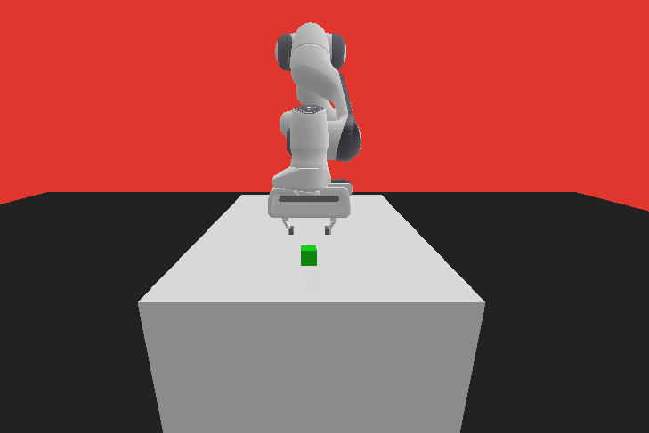
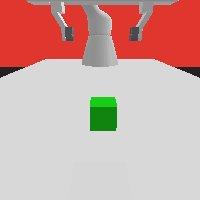
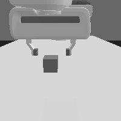
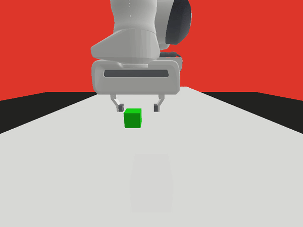

# Imitation-Learning-Pick-n-Place
Imitation learning is a technique in machine learning where an agent learns to perform tasks by mimicking expert behavior. Unlike traditional reinforcement learning, which relies on rewards to guide learning, imitation learning directly leverages demonstrations from experts to train models more efficiently and effectively. 

# Pick and Place with FRANKA

  

This project implements a pick and place scenario using the Panda Gym library with custom wrappers.

## Environment

The environment is defined by a class called `PandaEnv` that handles rendering, the robot, and the task. The task involves moving an object from a random initial position in the xy plane to a constant goal position.

### Task Details
- Object starts at uniformly random positions in the xy plane: \( 0 \leq x \leq \text{range} , -\text{range} \leq y \leq \text{range} \)
- The camera placement is optimized for a clear view of the object.
- Image processing involves converting images to grayscale

    
    

## Expert

The expert system for the pick and place task uses a Finite State Machine (FSM) and the built-in inverse kinematics of Panda Gym. The FSM operates as follows:
1. Move to the object.
2. If the object is reached, grab it and move to the goal.
3. If the object is lost, return to the object.
4. If the goal is reached, release the object.

  

## Agent Training

The agent is trained using the DAGGER algorithm, leveraging the expert system's demonstrations to iteratively improve the policy.

## Results

The trained policy's performance is evaluated by measuring the error from the goal position over multiple attempts. In most cases, the error reaches 0.05, indicating successful task completion. However, in some instances (2 out of 15), the policy prematurely releases the object.

  

## Conclusion

This project demonstrates the effectiveness of using DAGGER for training agents in complex tasks with visual feedback. The main challenges encountered include increasing dataset size, risk of overfitting, and balancing exploration and exploitation.

## Notable Observations
- DAGGER has some disadvantages, such as increasing dataset size, potential overfitting, and the exploration-exploitation trade

